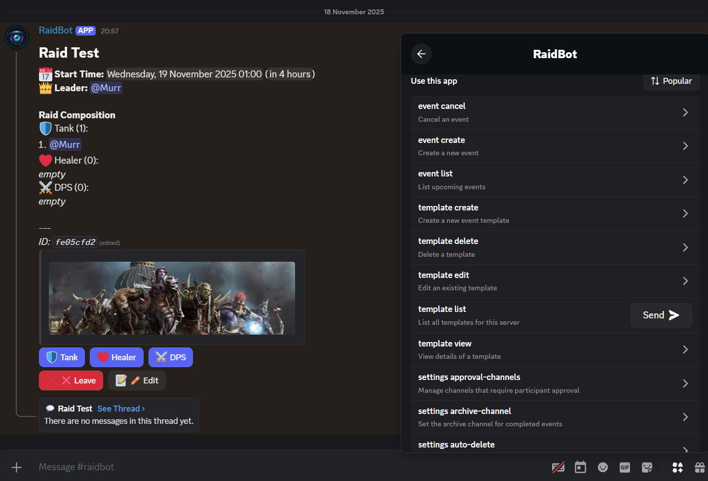
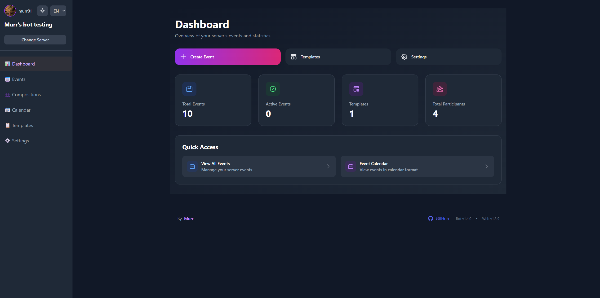
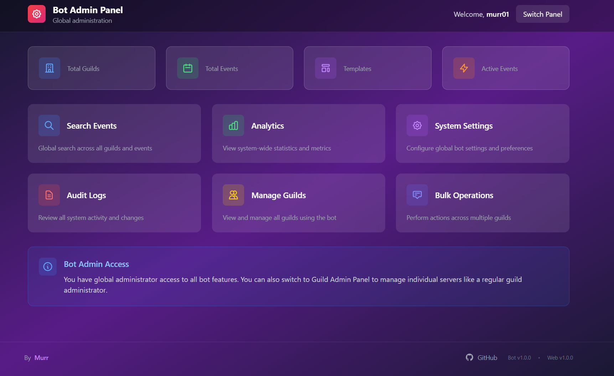

# Discord Raid Bot

A powerful Discord event management system with automatic voice channels, web dashboard, and advanced scheduling.

[](https://discord.com/developers/applications)
[](https://www.docker.com/)
[](https://www.typescriptlang.org/)
[](https://www.prisma.io/)
[](https://nodejs.org/)
[](LICENSE)

---

## 📸 Screenshots

<div align="center">

### Discord Event Management


### Server Admin Panel  


### Bot Admin Panel  


</div>

---

## ✨ Key Features

🎯 **Interactive Events** - Slash commands with buttons/menus for signup  
🎤 **Auto Voice Channels** - Temporary channels created/deleted automatically  
📝 **Templates** - Reusable configurations with role limits  
⏰ **Smart Scheduler** - Reminders, archiving, voice cleanup  
🌐 **Web Dashboard** - Full management via browser  
📊 **Statistics** - Track participation and attendance  
🌍 **Multi-language** - EN, RU, DE support  
🐳 **Docker Ready** - One command deployment  

---

## 🚀 Quick Start

### Installation

```bash
git clone https://github.com/vtstv/DiscordRaidBot.git
cd DiscordRaidBot
cp .env.example .env
# Edit .env with your Discord token
docker-compose up -d
```

**Invite bot:** `https://discord.com/oauth2/authorize?client_id=YOUR_CLIENT_ID&permissions=2147485696&scope=bot%20applications.commands`

**Web dashboard:** http://localhost:3000

📖 **[Full Installation Guide](docs/INSTALLATION.md)**

### Basic Usage

```bash
/event create        # Create event
/config              # Configure settings  
/template create     # Create template
/stats               # View statistics
```

📖 **[Complete User Guide](docs/USER_GUIDE.md)**

---

## 📚 Documentation

| Guide | Description |
|-------|-------------|
| **[Installation](docs/INSTALLATION.md)** | Setup with Docker or manual install |
| **[User Guide](docs/USER_GUIDE.md)** | Commands and features walkthrough |
| **[Configuration](docs/CONFIGURATION.md)** | All settings explained |
| **[Voice Channels](docs/VOICE_CHANNELS.md)** | Automatic voice channel setup |

---

## 🛠️ Tech Stack

**Backend:** TypeScript, Node.js 20+, discord.js v14  
**Database:** PostgreSQL + Prisma ORM 7.0  
**Frontend:** React, Tailwind CSS, Vite  
**Infrastructure:** Docker, Redis, nginx (optional)

---

## 🎯 Core Features

### Event Management
- Create/edit/delete events via Discord or web
- Interactive signup with buttons and select menus
- Role-based participant limits with waitlist
- Automatic reminders and archiving
- Participant notes for managers

### Voice Channels
- Auto-create temporary channels before events
- Participant-only restriction option
- Auto-delete after configurable duration
- Extend lifetime for long-running events

### Templates
- Reusable event configurations
- Role limits (Tank: 2, Healer: 3, DPS: 10)
- Custom emoji and descriptions
- Quick event creation

### Web Dashboard
- Modern responsive UI
- OAuth login with Discord
- Event calendar and list views
- Template editor
- Statistics and analytics
- Admin panel for global management

---

## 🐳 Docker Deployment

**Full stack:**
```bash
docker-compose up -d
```

**Bot only (minimal):**
```bash
docker-compose up -d bot postgres redis
```

## ⚙️ Configuration

Configure via `/config` command or web dashboard:

- **Language** - EN, RU, DE
- **Timezone** - Auto time conversion
- **Reminders** - Custom intervals
- **Voice Channels** - Category, duration, timing
- **Permissions** - Manager roles, approval channels

📖 **[Configuration Reference](docs/CONFIGURATION.md)**

---

## 📊 Statistics

Track engagement with `/stats`:
- Events attended/created
- Most used roles
- Attendance rate
- Automated reports (weekly/monthly)

---

## 🔧 Development

```bash
npm install
cp .env.example .env
npx prisma migrate deploy
npm run dev
```

**Build:** `npm run build`  
**Test:** `npm test`

---

## 🤝 Contributing

Contributions welcome! Please open issues or pull requests.

---

## 📄 License

MIT License - see [LICENSE](LICENSE) file.

---

## 🆘 Support

- 📖 [Documentation](docs/)
- 🐛 [Issues](https://github.com/vtstv/DiscordRaidBot/issues)
- 💬 [Discussions](https://github.com/vtstv/DiscordRaidBot/discussions)

---

**Made with ❤️ by [Murr](https://github.com/vtstv)**
